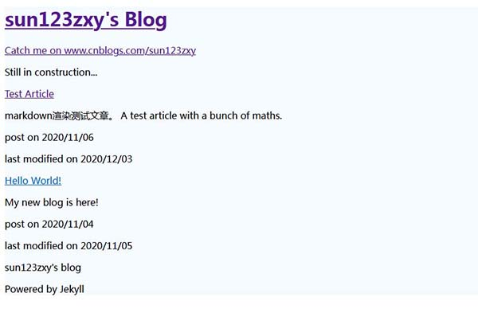
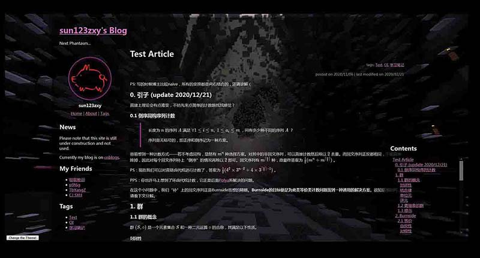

## 杂谈

很早就在考虑自建博客的事情了。

大概是 18 年吧，根据 OIer 传统，打算开个博客存点模板和学习笔记。博客园广告少，dalao 多，还能自定义 css/js 美化博客，~~比隔壁 CSDN 不知道高到哪里去了~~，虽然不是很懂前端，但一看就来劲了，开始折腾。于是一个暑假 OI 没啥进步，倒是写了一车 css/js 修改自带皮肤，整出来一套多主题切换系统。之后又经过了数次大改重构，适配了 markdown 编辑器，功能日趋完善。

然而改版越来越多，代码越来越乱，寄人篱下也总有这样那样的不方便之处。想来想去，改别人的东西总是有极限的，与其无数次推倒重构，还不如自己去搭个新的。

这么想着又咕了几个月（笑）

直到 20 年晚些时候才开始认真思考这个问题。一开始也是打算在 Hexo 或 Jekyll 上直接套个主题改改就好，毕竟是相当省事。只是某天在机房摸鱼学了波 Jekyll 后，突然一想——折腾博客也两三年了，懂的前端也不少了，又打算自己搭博客，要不干脆从零手撸个出来？

于是又摸了大半年，差不多可以用了。

以前用 markdown 写的文章都搬过来了，其他的回头再说吧。~~好像也没啥保留价值~~

那么，之后就在这边安家了。博客园那边应该还会同步发布，但后续的更新和修改就不能保证了。

静态博客的评论要托管，之前感觉有点麻烦就没搞。后来想用基于 Github Issue 的现成轮子来做，但是不论是 [Gitalk](https://github.com/gitalk/gitalk) 还是 [Gitment](https://github.com/imsun/gitment) 都得把 OAuth 的 Client Secret 写在前端，太不安全了；倒是有个叫 [Utterances](https://github.com/utterance/utterances) 的基于 Github Apps 的小众项目好像还行，研究ing... ~~或者哪天自己写个调 Github API 的 js 算了~~

总之目前的话想评论什么的还是去博客园吧（这博客真的有人看吗）

还有，话说正式启用博客的时间正好是 8 月 17 日，这个时间...

~~是妖妖梦、风神录正式版发售时间~~

~~给国家省点子弹吧（~~

## 搭建随想

写写搭建过程中的一些小细节。

[博客源码](https://github.com/sun123zxy/blog-code)

### 技术 & 功能

+ 基于 [Jekyll](https://jekyllrb.com/) 和 [jekyll-pandoc](https://github.com/mfenner/jekyll-pandoc) 插件，配合自制小工具 [InlineMathSpaceKiller](https://github.com/sun123zxy/InlineMathSpaceKiller) 的静态 markdown 博客。
+ 全站 js 和主题切换动画效果使用 [JQuery](https://jquery.com/)。
+ 支持锚点跳转的目录系统。
+ 数学公式使用 [KaTeX](https://katex.org/) 渲染。
+ 代码高亮使用 [highlight.js](https://highlightjs.org/) 分析代码结构，配合魔改后的样式表实现。

### 数学公式、jekyll-pandoc 和 InlineMathSpaceKiller

~~用插件干啥啊好好用原生 Jekyll Github 自动帮你编译它不香吗~~

本地我用 Typora 编写 markdown，希望能在上传过程中尽可能少地改动源文件，这包括内嵌的 $\LaTeX$ 数学公式。但 Jekyll 自带的 markdown 解析器老是不好使，比如公式里的 `|` 被解析成表格了之类各种怪七怪八的问题...

于是 Google 了一圈找到了 jekyll-pandoc，可以改用 [Pandoc](https://www.pandoc.org/) 的文档解析来渲染 md。正好之前下过 Pandoc，研究了一波就给装上了。

jekyll-pandoc 的插件文档对 `_config.yml` 里面的参数设置给出了一个例子（然而已经过时了），但并没有说明具体原理——

>Additional pandoc options can be provided in the Jekyll `_config.yml`:
>
>```yaml
>pandoc:
>  extensions:
>    - normalize
>    - smart
>    - mathjax
>    - csl: _styles/apa.csl
>    - bibliography: bibliography/references.bib
>```

事实上这些参数等价于 Pandoc 的命令行参数，即上述代码等价于执行

```shell
pandoc --normalize --smart --mathjax --csl=_styles/apa.csl --bibliography=bibliography/references.bib
```

所以根据需求照着配就可以了。开启 `--mathjax` 可以自动把 `$` 和 `$$` 换成 `\(`、`\)` 和 `\[`、`\]`，可以直接被 KaTeX 提供的 `auto-render.min.js` 识别，非常方便。

不料还有个问题——Typora 允许存在形如 `$ \gcd(a,b) $` 这样 `$` 旁边紧跟着空格的行内公式，但 Pandoc 解析不了。后来翻到这个 [issue](https://github.com/jgm/pandoc/issues/5672)，官方似乎不打算修复这个问题，就写了个预处理工具删空格，新文章上传前 `spacekiller` 一下就可以了。

### 文章存储结构

并没有使用 Jekyll 自带的 posts。

我不喜欢这种图文分离的组织格式。文本和图片本来就同属一篇文章，强行把图片拆开放到 `/assets/images/.../` 里面既不合逻辑，又丧失了可移植性，匪夷所思。

最后使用了打开 output 选项的 collection 来实现，每篇文章都有一个独立的文件夹，包含 `index.md` （文本）和所需图片、文件等所有内容。`index.md` 里面直接使用相对引用插入图片，和无博客状态下写作体验完全一致，岂不美哉。

### 页面设计

白模写好后就开肝 css，一开始完全参考之前魔改的博客园 iMetro 主题整出来个高仿，后来有了一些更好的想法，比如把侧边栏做成 panel 样式之类的，就成现在这个样子了。

## 画廊

（最早的版本没截图找不到了）







